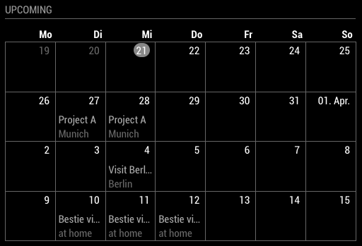

# MMM-MonthlyCalendar

MMM-MonthlyCalendar is a module for the [MagicMirror](https://github.com/MichMich/MagicMirror) project by [Michael Teeuw](https://github.com/MichMich).

[](https://codeclimate.com/github/raywo/MMM-MonthlyCalendar/maintainability) 
[](https://codeclimate.com/github/raywo/MMM-MonthlyCalendar/test_coverage)
[](https://snyk.io/test/github/raywo/mmm-MonthlyCalendar?targetFile=package.json)
[](https://greenkeeper.io/)
[](https://david-dm.org/raywo/MMM-MonthlyCalendar)
[](https://gitter.im/raywo)


This module displays calendar entries in a grid view much like the monthly view in your favourite calendar app. It collects its data from an url which delivers data in the iCal standard.


## How it works

This module is optimized for a very special use case. It displays **full day** calendar entries in a grid view. Due to the limited available screen size in a MagicMirror the module can only display one entry per day. Currently it displays the entry’s summary and location. In future versions it is maybe possible to show two entries with only their summary displayed. But no promises.

It is possible to fetch from multiple calendars. All entries will eventually be merged into one big data set and displayed. In case there are multiple entries for one day the entry from the calendar with the highest priority is displayed. If no priority is given for the calendars it is not determined which event will be displayed.

Calendars are fetched from the given url. You can display any public calendar as long as it supports the iCal standard (which all major apps do). If you want to display a private calendar there is also a possibility to do so (see [Display private iCloud calendars](#display-private-icloud-calendars)).

I know that this is a very special use case but maybe this module is of use to someone else too.


## Screenshot




## Preconditions

* MagicMirror<sup>2</sup> instance
* Node.js version >= 7
* npm


## Installing

Just clone the module into your MagicMirror modules folder and execute `npm install` in the module’s directory:

```bash
git clone https://github.com/raywo/MMM-MonthlyCalendar.git
cd MMM-MonthlyCalendar
npm install
```


## Updating

Go to the module’s folder inside MagicMirror modules folder and pull the latest version from GitHub and install:

```bash
git pull
npm install
```


## Display private iCloud calendars

In order to be able to display private calendars you need a way to access them. This module uses [vdirsyncer](https://github.com/pimutils/vdirsyncer) for this purpose. There is a very [nice article](https://forum.magicmirror.builders/topic/5327/sync-private-icloud-calendar-with-magicmirror) on the forums on how to get it working. I’ll provide only the short version:

1. Create an [app-specific password](https://support.apple.com/en-us/HT204397) in iCloud. (You don’t want to use your actual password since it will be stored in a config file. Instead you use app-specific passwords which can easily be revoked.)
2. Install `vdirsyncer`.

   ```bash
   sudo apt-get install libxml2 libxslt1.1 zlib1g python3 python3-pip
   sudo pip3 install virtualenv
   
   virtualenv ~/vdirsyncer_env
   ~/vdirsyncer_env/bin/pip3 install vdirsyncer
   ```
   
3. Add `alias vdirsyncer="~/vdirsyncer_env/bin/vdirsyncer"` to your `.bashrc` file.

4. Configure `vdirsyncer` to use your account with your favourite provider and store the synced calendar entries in a local file inside `magic_mirror/modules/`. <br><br>
   Edit `~/.config/vdirsyncer/config` (Leave the `collections` array empty in this step. Just provide your user name and app-specific password.)
   
   ```bash
   # vdirsyncer configuration for MagicMirror.
   #
   # Move it to ~/.vdirsyncer/config or ~/.config/vdirsyncer/config and edit it.
   # Run `vdirsyncer --help` for CLI usage.
   #
   # Optional parameters are commented out.
   # This file doesn't document all available parameters, see
   # http://vdirsyncer.pimutils.org/ for the rest of them.
    
   [general]
   # A folder where vdirsyncer can store some metadata about each pair.
   status_path = "~/.vdirsyncer/status/"
 
   # CALDAV Sync
   [pair iCloud_to_MagicMirror]
   a = "Mirror"
   b = "iCloud"
   collections = [ 
     "HERE-GOES-THE-UUID-OF-THE-CALENDAR-YOU-WANT-TO-SYNC",
     "HERE-GOES-ANOTHER-UUID-OF-THE-CALENDAR-YOU-WANT-TO-SYNC" 
   ]
 
   # Calendars also have a color property
   metadata = ["displayname", "color"]
 
  [storage Mirror]
  # We need a single .ics file for use with the mirror (Attention! This is really slow on big amounts of events.)
  type = "singlefile"
 
  # We'll put the calendar file to a readable location for the calendar module
  path = "/home/pi/MagicMirror/modules/MMM-MonthlyCalendar/calendars/%s.ics"
  
  [storage iCloud]
  type = "caldav"
  url = "https://caldav.icloud.com/"
 
  # Authentication credentials
  username = "YOUR-ICLOUD-EMAIL-ADDRESS"
  password = "HERE-GOES-YOUR-APP-SPECIFIC-ICLOUD-PASSWORD"
 
  # We only want to sync in the direction TO the mirror, so we make iCloud readonly
  read_only = true
 
  # We only want to sync events
  item_types = ["VEVENT"]
 
  # We need to keep the number of events low, so we'll just sync the next month
  # Adjust this to your needs
  start_date = "datetime.now() - timedelta(days=1)"
  end_date = "datetime.now() + timedelta(days=30)"
  ```
  
5. Let `vdirsyncer` discover your iCloud calendars
   `vdirsyncer discover`
   
   ```bash
   Discovering collections for pair iCloud_to_MagicMirror
   Mirror:
   iCloud:
     - "M2CD-1-1-..." ("Office")
     - "M2CD-3-1-..." ("Private")
     - "M2CD-6-1-..." ("Holidays")
   ```
       
6. Copy the IDs of the calendars you want to sync and paste them into `~/.config/vdirsyncer/config` under `collections`. Keep in mind to surround them with `"`!

   ```bash
   collections = [ 
     "M2CD-1-1-...", 
     "M2CD-3-1-..."
   ]
   ```

7. Run `vdirsync discover` again. When prompted with the question whether to create a file for your calendar answer with `y`.

   ```bash
   warning: No collection "M2CD-6-1-..." found for storage Mirror.
   Should vdirsyncer attempt to create it? [y/N]:
   ```

   This will create an empty file.
   
8. Run `vdirsyncer sync` to sync the events from iCloud into your local file.

9. Use the stored calendar with this module. (You can link to a local file with referring to `localhost` (example: `"http://localhost:8080/modules/MMM-MonthlyCalendar/calendars/<FILE_NAME_OF_YOUR_CALENDAR>.ics"`)

10. Configure `vdirsyncer` to run as a system service.

    Download the following files:
    
    ```
    curl https://raw.githubusercontent.com/pimutils/vdirsyncer/master/contrib/vdirsyncer.service | sudo tee /etc/systemd/user/vdirsyncer.service
    curl https://raw.githubusercontent.com/pimutils/vdirsyncer/master/contrib/vdirsyncer.timer | sudo tee /etc/systemd/user/vdirsyncer.timer
    ``` 
    
    Update `/etc/systemd/user/vdirsyncer.timer` to your needs.
    
    ```
    [Unit]
    Description=Synchronize vdirs

    [Timer]
    OnBootSec=5m
    OnUnitActiveSec=15m
    AccuracySec=5m

    [Install]
    WantedBy=timers.target
    ```
    
    Activate the service by running `systemctl --user enable vdirsyncer.timer`.

**Note:** This procedure is only tested with Apple iCloud calendars but it should work with other providers in a similar way too.


## Configuration

There is not very much to configure but some key setting must be done in order to enjoy this module.

| Option | Description |
|--------|-------------|
| `updatesEvery ` | An integer describing how often the module should refresh its display.<br><br>**Type:** `integer` **optional**<br>**Example:** `30` <br>**Default Value:** `120` <br><br>**Note:** The value is given in minutes. Please be aware that this setting should match your `vdirsyncer` settings if you’re using `vdirsyncer`. It makes no sense to refresh your display every ten minutes if `vdirsyncer` fetches new entries only every 30 minutes. |
| `weeksInFuture ` | An integer describing how many weeksin the future should be displayed.<br><br>**Type:** `integer` **optional**<br>**Example:** `5` (Displays five rows.) <br>**Default Value:** `4`<br><br>**Note:** Please keep in mind that setting this option to a high value can lead to overlapping modules on your MagicMirror.|
| `calendars` | An array of calendars to be displayed.<br>A calendar object looks like:<br>`{`<br>&nbsp;&nbsp;`url: "some valid url",`<br>&nbsp;&nbsp;`priority: 1`<br>`}` <br><br>**Type:** `array` **required**<br>**Example:** `[ { url: "http://localhost:8080/modules/MMM-MonthlyCalendar/calendars/<FILE_NAME_OF_YOUR_CALENDAR>.ics", priority: 1} ]`  <br>**Default Value:** `[]`<br><br>**Note:** See `url` and `priority` for more information.|
| `url` | A string representing a valid url for a calendar.<br><br>**Type:** `string` **required**<br>**Example:** `"http://localhost:8080/modules/MMM-MonthlyCalendar/calendars/<FILE_NAME_OF_YOUR_CALENDAR>.ics"` (Points to a local file.) <br>**Default Value:** `none`<br><br>**Note:** If you want to link to a local file place the file somewhere inside `magic_mirror/modules/`. That way you’ll get access to it via `localhost`. |
| `priority` | An integer describing the priority of the calendar. Lower values describing a higher priority.<br><br>**Type:** `integer` **optional**<br>**Example:** `1` <br>**Default Value:** `none`<br><br>**Note:** It is ensured that events from the calendar with the highest priority will always be visible. If there are multiple events on the same day it is not determined which event will be displayed. Please make sure that no two calendars have the same priority. If two calendars have the same priority it is not determined which one will be displayed first. |
				
Here is an example for an entry in `config.js`

```javascript
{
  module: "MMM-MonthlyCalendar",
  position: "top_left",
  
  config: {
    updatesEvery: 30,
    weeksInFuture: 5, 

    calendars: [
      {
        url: "http://localhost:8080/modules/MMM-MonthlyCalendar/calendars/<FILE_NAME_OF_YOUR_CALENDAR>.ics",
        priority: 1
      },
      {
        url: "https://p01-calendars.icloud.com/holiday/DE_de.ics",
        priority: 2
      }
    ]
  }
},
```


## Special Thanks

* [Michael Teeuw](https://github.com/MichMich) for inspiring me and many others to build a MagicMirror module.
* [Beh](https://forum.magicmirror.builders/user/beh) for posting an inspiring [forum post](https://forum.magicmirror.builders/topic/5327/sync-private-icloud-calendar-with-magicmirror) about vdirsyncer.
* The community of magicmirror.builders for help in the development process and all contributors for finding and fixing errors in this module.


## Contributing

If you find any problems, bugs or have questions, please [open a GitHub issue](https://github.com/raywo/MMM-MonthlyCalendar/issues) in this repository.
